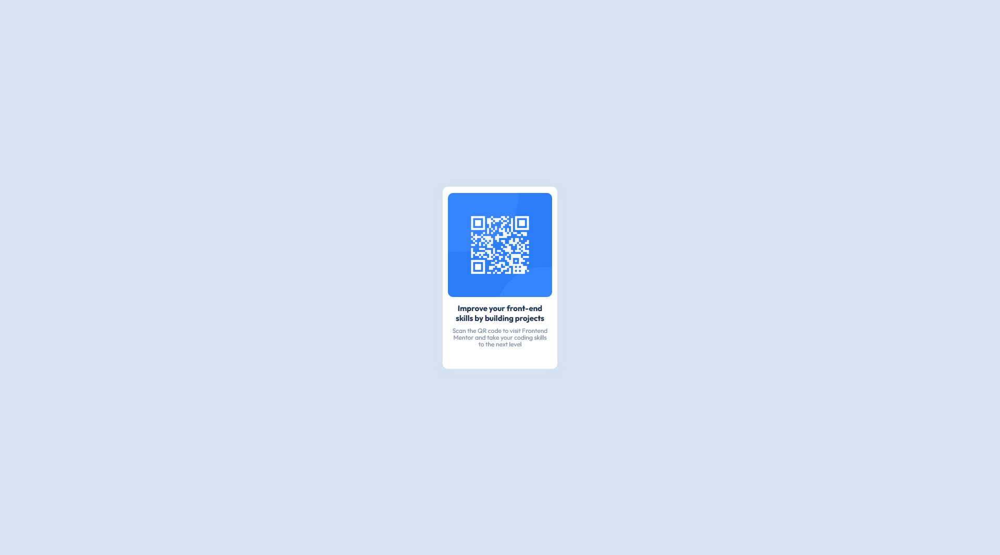

# Frontend Mentor - QR code component solution

This is a solution to the [QR code component challenge on Frontend Mentor](https://www.frontendmentor.io/challenges/qr-code-component-iux_sIO_H). Frontend Mentor challenges help you improve your coding skills by building realistic projects. 

## Table of contents

- [Overview](#overview)
  - [Screenshot](#screenshot)
  - [Links](#links)
- [My process](#my-process)
  - [Built with](#built-with)
  - [What I learned](#what-i-learned)
  - [Continued development](#continued-development)
  - [Useful resources](#useful-resources)
- [Author](#author)
- [Acknowledgments](#acknowledgments)

**Note: Delete this note and update the table of contents based on what sections you keep.**

## Overview

### Screenshot

### Links

- Solution URL: [Add solution URL here](https://github.com/sneakynicky/QRCodeRepository)
- Live Site URL: [Add live site URL here](https://sneakynicky.github.io/)

## My process
I looked at the provided images and started to draw it out on a piece of paper to list down the components needed. Once I had an idea, I decided to use Flexbox only because it seemed to be only a one-dimensional process. 

Next, I started by creating the components in the HTML file like how I imagined it would be nested. From there, I took it from the outside-in approach from the container to the card, to the image, to the header and content. 

### Built with

- Flexbox

### What I learned

1. I actually don't know how to start and address the CSS challenge. I think that I know what I'm doing but it seems to be a lot of just trial and error. Mostly, I just don't how how to tackle the styling problem and address it methodically. 
2. Spacing and positioning still eludes me. Even though I'm using Flexbox (because I need to learn it), I don't quite understand what I'm doing and solely relying on my older ways to figure out how to get things done. 
3. I learnt to use the @import statement. That's new to me. 

### Continued development

I want to be able to create layouts and components using Flexbox first. Understanding how it works along with what other content I need to know like box sizing, padding, margins, spacing. When do I use rem? When do I use em? I need to figure this out. 

### Useful resources

- [Example resource 1](https://www.example.com) - This helped me for XYZ reason. I really liked this pattern and will use it going forward.
- [Example resource 2](https://www.example.com) - This is an amazing article which helped me finally understand XYZ. I'd recommend it to anyone still learning this concept.

**Note: Delete this note and replace the list above with resources that helped you during the challenge. These could come in handy for anyone viewing your solution or for yourself when you look back on this project in the future.**

## Author

- Website - [Dominic](https://sneakynicky.github.io)
- Frontend Mentor - [@sneakynicky](https://www.frontendmentor.io/profile/sneakynicky)
